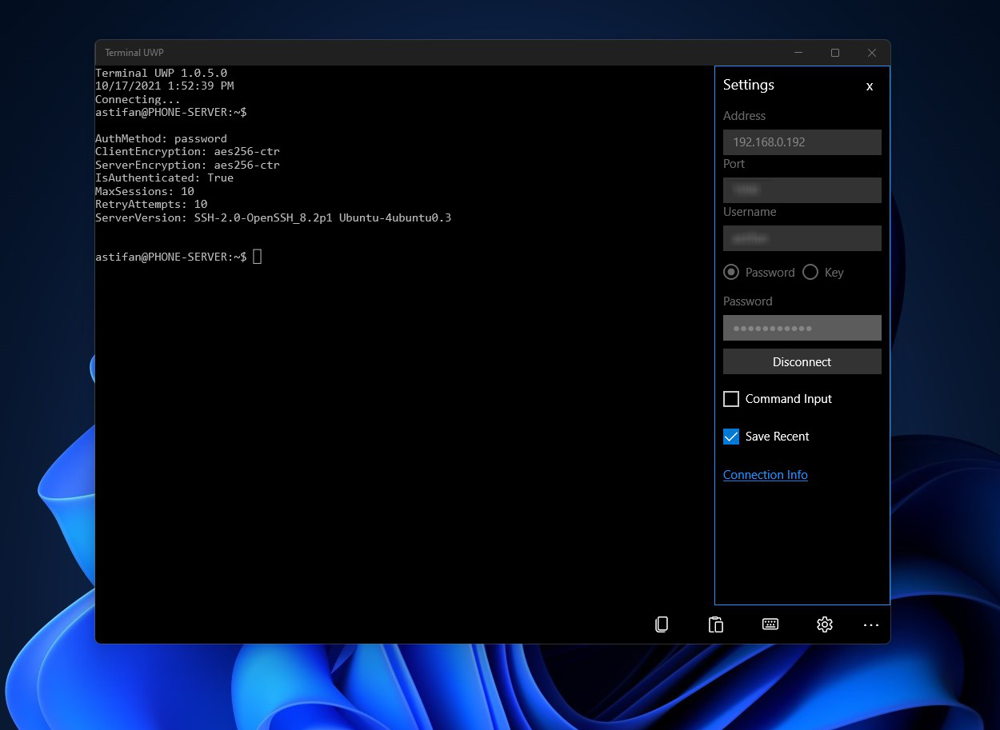

   
  <b>Enhanced terminal emulator (UWP) based on TerminalEmulatorUWP by Darren R. Starr</b> 
  <a href="./src">Source</a> |
  <a href="./src/3rdparty/SSH.NET">Libraries</a> |
  <a href="https://github.com/darrenstarr/TerminalEmulatorUWP">Original Project</a> 
    
    

# Features

- Re-Design the layout
- Commands History
- Scroll Mode
- Encrypted Profiles
- Save output as text
- Bugs fixes (including font issue)

# Build

It will work with build 16299 and above

For Windows Phone users (if you still have one) it will work on build 1709 (15254) only